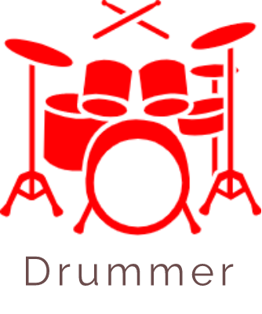
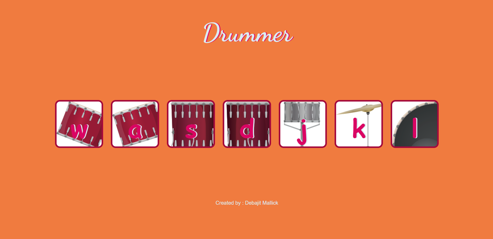

  

# Drummer
A website where you play ▶ your favourite drum sounds.

# Motivation 
Create this website mainly for fun purposes and also to help others to start their open source journey in web developement.

# Build Status

# Screenshots

# Tech/Framework Used
**Built with**
1. [HTML5](https://developer.mozilla.org/en-US/docs/Web/HTML)
1. [CSS3](https://developer.mozilla.org/en-US/docs/Web/css)
1. [JavaSript](https://developer.mozilla.org/en-US/docs/Web/javascript)

# Code Style
Just follow the 
[JavaScript style guides ](https://google.github.io/styleguide/jsguide.html) by google

# How to use?
If you want to use the website just go to this [link](https://drummerapp.netlify.app/)
* If you open the site in touch screen devices just tap on the drum.
* If you open the site in PC then just tap on the drum or press the key of keyboard corresponding to the drum.

# How to contribute?
1. Fork the project.
1. Create a different branch.
1. Add your code to that branch.
1. Create a [pull request](https://docs.github.com/en/github/collaborating-with-issues-and-pull-requests/creating-a-pull-request) 

Made with :heart: and :coffee: by Debajit Mallick

